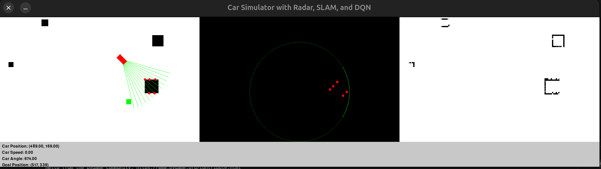

# Car Simulator with SLAM and DQN

This project implements a 2D car simulator with Simultaneous Localization and Mapping (SLAM) and a Deep Q-Network (DQN) for autonomous navigation. The simulation includes manual driving mode and AI training mode.

## Project Overview

The simulator features a car that can be controlled manually or by an AI agent. The car navigates in an environment with randomly placed obstacles and a goal. The simulation includes:

1. A main simulation view
2. A radar view
3. A SLAM map view
4. A data display showing car and goal information


## Key Components

- `simulator.py`: Contains the main `Simulator` class and `DQNAgent` class
- `main.py`: Entry point for running the simulation
- `car.py`: Implements the `Car` class
- `obstacle.py`: Implements the `Obstacle` class
- `radar.py`: Implements the `Radar` class
- `slam_map.py`: Implements the `SlamMap` class

## Requirements

- Python 3.x
- PyGame
- PyTorch
- NumPy

## Installation

1. Clone this repository
2. Install the required packages:
   ```
   pip install pygame torch numpy
   ```

## Usage

Run the simulation using:

```
python main.py
```

The `main.py` file is set up to run in AI mode by default, training for 10 episodes. You can modify the following variables in `main.py` to change the simulation parameters:

- `mode`: Set to "ai" for AI training or "manual" for manual control
- `num_episodes`: Number of training episodes for AI mode

## Modes

### Manual Mode

In manual mode, you can control the car using arrow keys:
- Up: Accelerate
- Down: Decelerate/Reverse
- Left/Right: Turn

### AI Mode

In AI mode, the DQN agent will train to navigate the car to the goal while avoiding obstacles. After training, it will run the trained agent.

## Testing

Run the unit tests using:

```
python -m unittest tests.py
```
