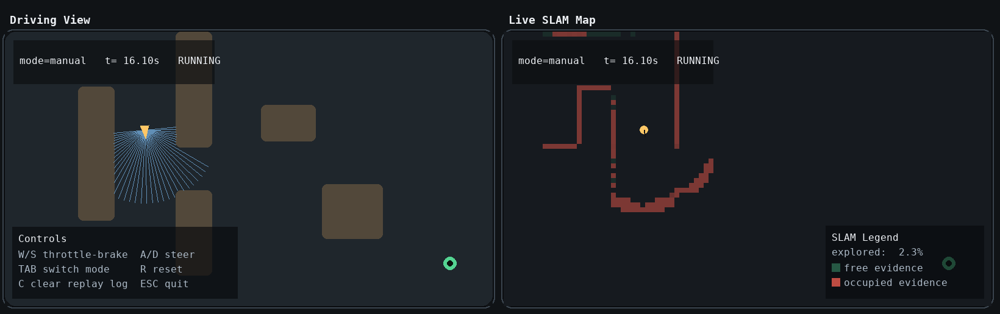
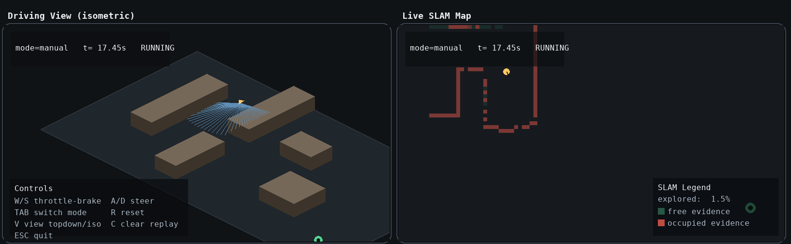

# DriveSim

DriveSim is a stylized 2D driving and SLAM simulator with an ML-ready API.

## Current UI Snapshots




## Features (v0.1)
- Deterministic 2D simulator with vehicle kinematics and collision handling
- Lidar-style raycast sensing
- Occupancy-grid mapping as a SLAM building block
- Cost-aware A* path planning (with smoothing) and a lightweight path-following controller
- Gym-like environment API (`reset`, `step`)
- Stylized Pygame visualization for demo and debugging
- Side-by-side driving view and live SLAM map view
- Chase (default), 3D-style isometric, and top-down driving cameras
- Multiple map presets (`default`, `maze`, `blocks`, `generated_easy`, `generated_medium`, `generated_hard`) switchable at runtime
- Optional chunk-based world expansion while driving
- Dynamic moving obstacles with online replanning support
- Episode replay logging as JSONL
- Deterministic `reset(seed=...)` behavior for reproducible experiments

## Quickstart

```bash
python -m venv .venv
source .venv/bin/activate
pip install -e .[dev]
drivesim-run
```

Viewer controls:
- `W/S`: throttle / brake
- `A/D`: steer
- `TAB`: switch mode (`manual` / `autopilot` / `assistant`)
  Modes include `train-live`, where the AI drives and updates online in the visible window.
- `R`: reset
- `M`: switch map preset (`default` / `maze` / `blocks` / generated variants)
- `V`: switch driving camera (`chase` / `3d` / `topdown`)
- `F`: switch camera behavior (`follow` / `tactical` / `cinematic`)
- `E`: toggle auto-expanding world
- `P`: save current best live-trained model to `models/assist_policy.npz`
- `H`: toggle controls overlay
- `C`: clear replay log (`replays/latest_episode.jsonl`)
- `ESC`: quit

## Architecture
- `drivesim.core`: world model, vehicle, simulation loop
- `drivesim.autonomy`: sensing, mapping, planning, control
- `drivesim.ml`: gym-like env, assistant agent, replay logger
- `drivesim.ui`: renderer and interaction layer

## Model architectures
Model definitions live in [models.py](src/drivesim/ml/models.py):
- `linear`: default lightweight policy used by replay training and auto-train
- `tiny_mlp`: compact neural policy architecture for future experiments

`assistant` mode loads architecture metadata from the model file and reports it in the HUD label.

## Tests

```bash
pytest
```

## ML training workflow (assistant policy)
1. Drive in `manual` or `autopilot` mode to collect replay data.
2. Train a policy from the replay log:

```bash
make train MODE=replay
```

3. Restart the app and switch to `assistant` mode.
If `models/assist_policy.npz` exists, the assistant uses that trained policy.

## Auto train mode (headless episodes)
Run many autonomous episodes without rendering and optimize for:
- reaching the goal
- avoiding collisions
- reducing distance to goal

```bash
make train-auto
```

Custom example:

```bash
make train MODE=auto
# or:
PYTHONPATH=src python3 -m drivesim.ml.train_auto --map maze --iterations 20 --population 30 --episodes 4
```

The trained model is saved to `models/assist_policy.npz` and is automatically used by `assistant` mode.
The command prints live training progress with candidate-level updates and ETA.
Use `--quiet` if you only want per-iteration summaries.

## Live training in the UI
Default:

```bash
make train
```

The left panel shows the AI driving while the HUD shows live metrics (`iter`, `cand`, `last`, `best`).
Episodes are randomized (different starts/goals and periodic map changes), so it does not repeat a single route.
If a pretrained linear model exists, `train-live` starts from it.
Press `P` anytime to persist the current best live model for `assistant` mode.
`train-live` is teacher-guided (autopilot blended with the model) to avoid spinning in place while improving.

## Evaluation workflow
Run fixed-seed, headless evaluation and report benchmark metrics:
- success rate
- collision rate
- average distance to goal
- average steps and episode reward
- per-map breakdown (`default`, `maze`, etc.)

```bash
make eval
```

Custom example:

```bash
PYTHONPATH=src python3 -m drivesim.ml.eval --maps default,maze,blocks --episodes 6 --seed 11 --policy assistant
```

Compare assistant vs autopilot in one run:

```bash
PYTHONPATH=src python3 -m drivesim.ml.eval --maps default,maze,blocks --episodes 6 --seed 11 --policy both
```

Shortcut:

```bash
make eval-compare
```

Write a JSON report for experiment tracking:

```bash
PYTHONPATH=src python3 -m drivesim.ml.eval --maps default,maze --episodes 6 --seed 11 --json-out replays/eval_latest.json
```

Auto-generate a timestamped report path:

```bash
PYTHONPATH=src python3 -m drivesim.ml.eval --policy both --json-auto
```

## Next steps
- Add a 3D renderer backend (for example Panda3D or a Unity bridge)
- Train an assistant policy from replay data
- Add dynamic obstacles and scenario generation

## Make targets
- `make install-dev`: install editable package with dev dependencies
- `make run`: start the simulator UI
- `make test`: run test suite
- `make train`: start visible `train-live` mode (default `MODE=live`)
- `make train MODE=live`: open UI directly in visible `train-live` mode
- `make train MODE=auto`: run headless self-training
- `make train MODE=replay`: train from replay log
- `make train-auto`: run headless self-training over many episodes
- `make eval`: run headless evaluation with fixed-seed metrics
- `make eval-compare`: compare assistant vs autopilot in one headless run
- `make eval-report`: compare policies and auto-save timestamped JSON to `replays/evals/`
