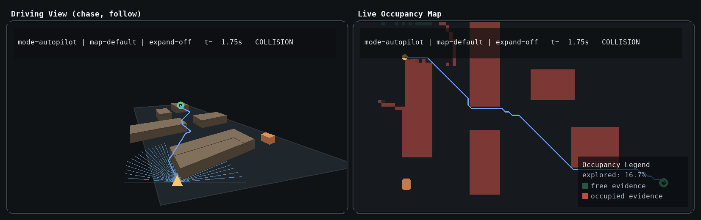
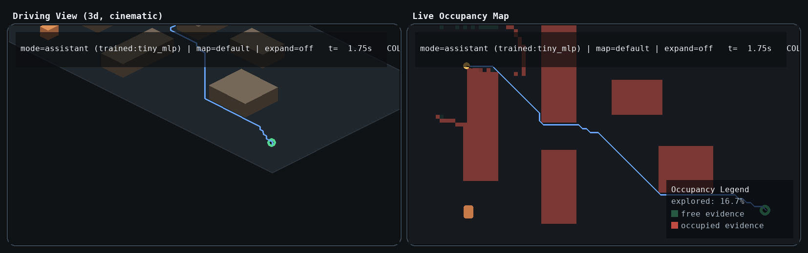
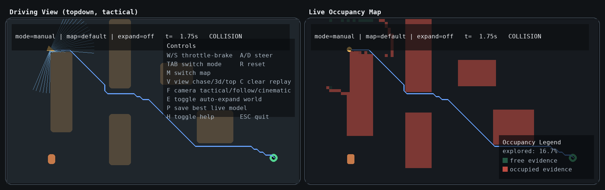
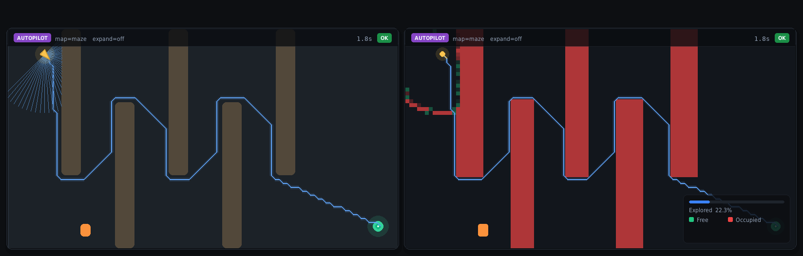
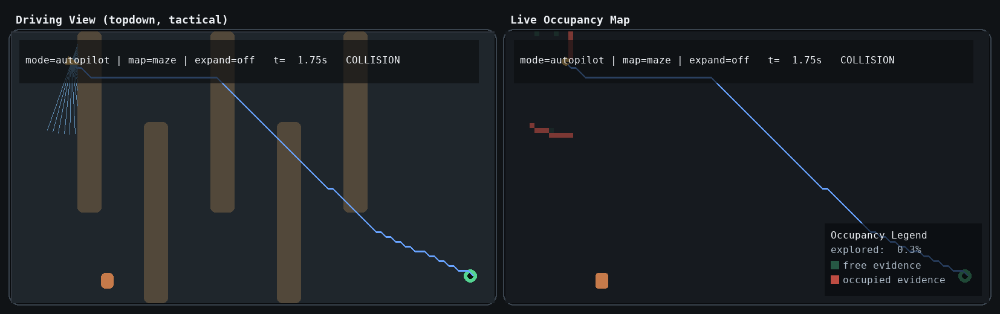
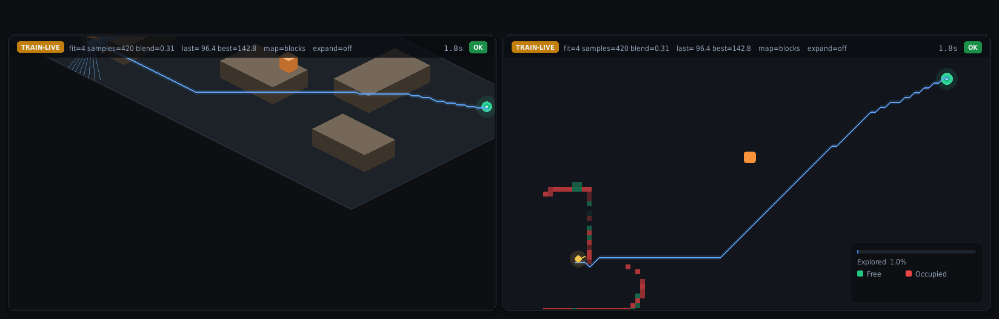

# DriveSim

DriveSim is a stylized 2D driving and autonomy simulator with an ML-ready API.

## Current UI Snapshots


## Quick Visual Tour

### Driving Cameras




### Mapping Modes
Ground-truth occupancy mode:



Sensor-driven occupancy mode:



### Live Training HUD


## Features (v0.1)
- Deterministic 2D simulator with vehicle kinematics and collision handling
- Lidar-style raycast sensing
- Occupancy-grid mapping with selectable modes (`ground_truth` / `sensor_driven`)
- Cost-aware A* path planning (with smoothing) and a lightweight path-following controller
- Gym/Gymnasium-compatible environment API for external RL frameworks
- Stable-Baselines3 PPO training entrypoint with checkpointing
- Curriculum presets (`easy`, `standard`, `robust`) for staged training and evaluation
- Experiment tracking for RL training and headless eval runs
- Stylized Pygame visualization for demo and debugging
- Side-by-side driving view and live occupancy map view
- Chase (default), 3D-style isometric, and top-down driving cameras
- Multiple map presets (`default`, `maze`, `blocks`, `generated_easy`, `generated_medium`, `generated_hard`) switchable at runtime
- Optional chunk-based world expansion while driving
- Dynamic moving obstacles with online replanning support
- Episode replay logging as JSONL
- Deterministic `reset(seed=...)` behavior for reproducible experiments
- One-command BC+DAgger training workflow for first-time users (`train-anyone`)

## Quickstart

```bash
python -m venv .venv
source .venv/bin/activate
pip install -e .[dev]
drivesim-run
```

Install RL extras for Gym + SB3 workflows:

```bash
pip install -e .[dev,rl]
```

Viewer controls:
- `W/S`: throttle / brake
- `A/D`: steer
- `TAB`: switch mode (`manual` / `autopilot` / `assistant`)
  Modes include `train-live`, where the AI drives and updates online in the visible window.
- `R`: reset
- `M`: switch map preset (`default` / `maze` / `blocks` / generated variants)
- `V`: switch driving camera (`chase` / `3d` / `topdown`)
- `F`: switch camera behavior (`follow` / `tactical` / `cinematic`)
- `E`: toggle auto-expanding world
- `P`: save current best live-trained model to `models/assist_policy.npz`
- `H`: toggle controls overlay
- `C`: clear replay log (`replays/latest_episode.jsonl`)
- `ESC`: quit

Start directly in 3D camera mode:

```bash
DRIVESIM_START_VIEW=3d drivesim-run
```

Start directly in assistant mode + 3D camera:

```bash
DRIVESIM_START_MODE=assistant DRIVESIM_START_VIEW=3d drivesim-run
```

Start with sensor-driven occupancy mapping:

```bash
DRIVESIM_MAPPING_MODE=sensor_driven drivesim-run
```

## Architecture
- `drivesim.core`: world model, vehicle, simulation loop
- `drivesim.autonomy`: sensing, mapping, planning, control
- `drivesim.ml`: gym env wrapper, RL trainer, curriculum presets, assistant agent, replay/logger tooling
- `drivesim.ui`: renderer and interaction layer

## Model architectures
Model definitions live in [models.py](src/drivesim/ml/models.py):
- `linear`: default lightweight policy used by replay training and auto-train
- `tiny_mlp`: compact neural policy architecture for future experiments

`assistant` mode loads architecture metadata from the model file and reports it in the HUD label.

## Tests

```bash
pytest
```

Run workflow-focused coverage (replay training, model save/load, trained assistant path, eval with model file):

```bash
make test-workflows
```

Refresh README screenshots from deterministic scripted captures:

```bash
make docs-media
```

## ML training workflow (assistant policy)
1. Drive in `manual` or `autopilot` mode to collect replay data.
2. Train a policy from the replay log:

```bash
make train MODE=replay
```

3. Restart the app and switch to `assistant` mode.
If `models/assist_policy.npz` exists, the assistant uses that trained policy.

## Auto train mode (headless episodes)
Run many autonomous episodes without rendering and optimize for:
- reaching the goal
- avoiding collisions
- reducing distance to goal

```bash
make train-auto
```

Custom example:

```bash
make train MODE=auto
# or:
PYTHONPATH=src python3 -m drivesim.ml.train_auto --map maze --iterations 20 --population 30 --episodes 4
```

The trained model is saved to `models/assist_policy.npz` and is automatically used by `assistant` mode.
The command prints live training progress with candidate-level updates and ETA.
Use `--quiet` if you only want per-iteration summaries.

## PPO training with SB3

Train a PPO policy against the Gym-compatible environment:

```bash
make train-rl
# equivalent:
PYTHONPATH=src python3 -m drivesim.ml.train_rl
```

Example with a staged curriculum:

```bash
PYTHONPATH=src python3 -m drivesim.ml.train_rl \
  --curriculum robust \
  --maps default,maze,blocks \
  --timesteps 8192 \
  --eval-episodes 2
```

Each run writes a dedicated directory under `models/rl/` with:
- `model.zip`
- `checkpoints/`
- `train_config.json`
- `eval.json`

## One-command trainer for anyone (recommended)
If you want a reliable default pipeline without hand-tuning, use the BC+DAgger trainer:

```bash
make train-anyone
# equivalent:
PYTHONPATH=src python3 -m drivesim.ml.train_anyone
```

Pass custom options through make:

```bash
make train-anyone TRAIN_ANYONE_ARGS="--profile strong --maps default,maze,blocks"
```

What it does:
- collects supervised driving data from the built-in autopilot on multiple maps
- trains a compact `tiny_mlp` policy with behavior cloning
- runs DAgger-style refinement rounds to reduce drift
- saves `models/assist_policy.npz`
- prints a final headless evaluation summary

Useful presets:

```bash
# ultra-fast smoke run
PYTHONPATH=src python3 -m drivesim.ml.train_anyone --profile quick

# stronger training pass (more episodes, slower)
PYTHONPATH=src python3 -m drivesim.ml.train_anyone --profile strong
```

The default `standard` profile is tuned for a better speed/quality balance on multi-map training.

3D validation after training:

```bash
DRIVESIM_START_MODE=assistant DRIVESIM_START_VIEW=3d make run
```

## Live training in the UI
Default:

```bash
make train
```

The left panel shows the AI driving while the HUD shows live metrics (`iter`, `cand`, `last`, `best`).
Episodes are randomized (different starts/goals and periodic map changes), so it does not repeat a single route.
If a pretrained linear model exists, `train-live` starts from it.
Press `P` anytime to persist the current best live model for `assistant` mode.
`train-live` is teacher-guided (autopilot blended with the model) to avoid spinning in place while improving.

## Evaluation workflow
Run fixed-seed, headless evaluation and report benchmark metrics:
- success rate
- collision rate
- average distance to goal
- average steps and episode reward
- per-map breakdown (`default`, `maze`, etc.)
- per-stage breakdown when using a curriculum

Mapping mode defaults to `ground_truth` and can be switched with `--mapping-mode sensor_driven`.

```bash
make eval
```

Custom example:

```bash
PYTHONPATH=src python3 -m drivesim.ml.eval --maps default,maze,blocks --episodes 6 --seed 11 --policy assistant
```

Sensor-driven evaluation example:

```bash
PYTHONPATH=src python3 -m drivesim.ml.eval --maps default,maze --episodes 4 --mapping-mode sensor_driven
```

Curriculum evaluation example:

```bash
PYTHONPATH=src python3 -m drivesim.ml.eval --policy autopilot --curriculum standard --episodes 2
```

Evaluate a trained PPO checkpoint:

```bash
PYTHONPATH=src python3 -m drivesim.ml.eval \
  --policy rl \
  --rl-algo ppo \
  --model models/rl/<run>/model.zip \
  --curriculum robust \
  --episodes 2
```

Compare assistant vs autopilot in one run:

```bash
PYTHONPATH=src python3 -m drivesim.ml.eval --maps default,maze,blocks --episodes 6 --seed 11 --policy both
```

Shortcut:

```bash
make eval-compare
```

Write a JSON report for experiment tracking:

```bash
PYTHONPATH=src python3 -m drivesim.ml.eval --maps default,maze --episodes 6 --seed 11 --json-out replays/eval_latest.json
```

Auto-generate a timestamped report path:

```bash
PYTHONPATH=src python3 -m drivesim.ml.eval --policy both --json-auto
```

When JSON is written (`--json-out` or `--json-auto`), a compact history entry is also appended to:
- `replays/evals/index.jsonl`

View recent/best history rows:

```bash
make eval-history
# or:
PYTHONPATH=src python3 -m drivesim.ml.eval_history --sort success --limit 20
# top single run:
PYTHONPATH=src python3 -m drivesim.ml.eval_history --best
# filter to strong runs on maze:
PYTHONPATH=src python3 -m drivesim.ml.eval_history --map maze --min-success 0.60 --sort success
```

For compare reports (`policy=both`), history rows include delta columns:
- `ds`: success-rate delta (assistant - autopilot)
- `dc`: collision-rate delta (assistant - autopilot)
- `dr`: reward delta (assistant - autopilot)

## Experiment history

RL training and CLI eval runs are tracked in:
- `replays/experiments/index.jsonl`

Show the latest runs:

```bash
make experiment-history
```

Query the best PPO run on the robust curriculum:

```bash
PYTHONPATH=src python3 -m drivesim.ml.experiment_history --kind train_rl --algo ppo --curriculum robust --best
```

## Next steps
- Add a 3D renderer backend (for example Panda3D or a Unity bridge)
- Train an assistant policy from replay data
- Add dynamic obstacles and scenario generation

## Make targets
- `make install-dev`: install editable package with dev dependencies
- `make install-rl`: install editable package with RL dependencies (`gymnasium`, `stable-baselines3`)
- `make run`: start the simulator UI
- `make test`: run test suite
- `make test-workflows`: run workflow-focused tests (train/model/eval coverage)
- `make docs-media`: regenerate README media assets under `imgs/readme/`
- `make docs-media-clean`: remove generated README media assets
- `make train`: start visible `train-live` mode (default `MODE=live`)
- `make train MODE=live`: open UI directly in visible `train-live` mode
- `make train MODE=anyone`: run one-command BC+DAgger trainer
- `make train MODE=auto`: run headless self-training
- `make train MODE=replay`: train from replay log
- `make train-anyone`: run one-command BC+DAgger trainer
- `make train-auto`: run headless self-training over many episodes
- `make train-rl`: run PPO training with the Gym/SB3 pipeline
- `make demo-3d`: start UI directly in 3D camera mode
- `make eval`: run headless evaluation with fixed-seed metrics
- `make eval-compare`: compare assistant vs autopilot in one headless run
- `make eval-report`: compare policies and auto-save timestamped JSON to `replays/evals/`
- `make eval-history`: show recent eval history rows from `replays/evals/index.jsonl`
- `make eval-best`: show the best recorded eval row by success rate
- `make experiment-history`: show tracked training/eval runs from `replays/experiments/index.jsonl`
